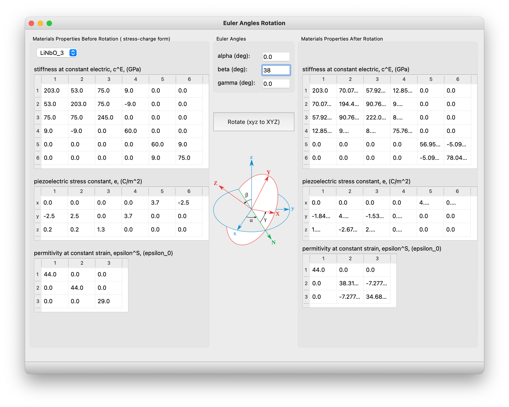

# acoustics
analysis and design of acoustic devices

## Introduction

This repository contains some notes and applications about how to analysis and design of acoustic devices, especially for surface acoustic wave (SAW) and thin film bulk acoustic resonator (FBAR) devices.

## Installation

`pip install -r requirements.txt`

## Description

* `/docs` includes technical notes, please open the `md` files with [typora](https://www.typora.io) to display equations correctly.

* `acoustics_testbench.py` is the testbench for `acoustics` package. The test examples are mainly from (Auld, 1973)

* `impulse.py` use **impulse model design method** to design the SAW delay line device. The data of materials properties are from (Campbell, 1998, Table 9.1) 

  
  
* `euler.py` calculate the materials properties after **Euler Angles Rotation**. Equations are from (Auld, 1973)

  

## References

=== **general** ===

* [Auld1973] Auld, B. A. (1973). *Acoustic fields and waves in solids*. John Wiley & Sons.
* [Campbell1998] Campbell, C. (1998). *Surface Acoustic Wave Devices for Mobile and Wireless Communications, Four-Volume Set*. Academic press.

=== **impulse model design method** ===

* [Hartmann1973] Hartmann, C. S., Bell, D. T., & Rosenfeld, R. C. (1973). Impulse Model Design of Acoustic Surface-Wave Filters. IEEE Transactions on Microwave Theory and Techniques, 21(4), 162–175. https://doi.org/10.1109/TMTT.1973.1127967
* [Wilson2007] Wilson, W. C., & Atkinson, G. M. (2007). Rapid SAW sensor development tools. NASA Tech Reports, 1–7.

=== **Euler angles rotation** ===

* https://en.wikipedia.org/wiki/Euler_angles

