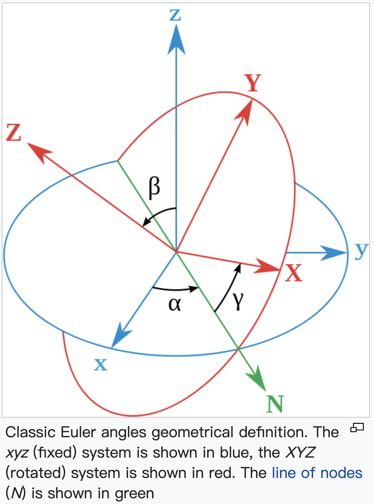

[toc]

# Basic Concepts of Acoustics

## Particle Displacement, Strain, and Stress

Acoustics is the study of time-varying deformations in material media. Particle displacement, strain, stress are the basic concepts.

### Particle Displacement

**Particle displacement field ($\mathbf u$ )** describe how particles are displaced from their equilibrium positions.

### Strain

**Strain field ($\mathbf S$)** is derived from particle displacement as
$$
S_{ij}(\mathbf r, t)=\frac{1}{2}(\frac{\partial u_i}{\partial r_j} + \frac{\partial u_j}{\partial r_i})
$$
where $\mathbf r$ is the position vector, $\mathbf r = \mathbf{\hat x}x + \mathbf{\hat y}y + \mathbf{\hat z}z$.

### Stress

Stress field ($\mathbf T$) is derived from paticle displacement and external force
$$
\nabla \cdot \mathbf T = \rho \frac{\partial^2\mathbf u}{\partial t^2} - \mathbf F
$$

## Symbolic Notation for Abbreviated System

* The shape of $\mathbf u$ is (3, 1);

* The shape of $\mathbf S$  is (3, 3)
  $$
  \mathbf S = \begin{bmatrix}
  S_{xx} & S_{xy} & S_{xz} \\
  S_{xy} & S_{yy} & S_{yz} \\
  S_{xz} & S_{yz} & S_{zz} \\ 
  \end{bmatrix}
  = \begin{bmatrix}
  S_1 & \frac{1}{2}S_6 & \frac{1}{2}S_5 \\
  \frac{1}{2}S_6 & S_2 & \frac{1}{2}S_4 \\
  \frac{1}{2}S_5 & \frac{1}{2}S_4 & S_3 \\
  \end{bmatrix}
  $$
  and (6, 1) in **abbreviated system**
  $$
  \mathbf S = \begin{bmatrix}
  S_1 \\ S_2 \\ S_3 \\ S_4 \\ S_5 \\ S_6 \\
  \end{bmatrix}
  $$

* The shape of $\mathbf T$ is same as $\mathbf S$

* Therefore, 
  $$
  S_I =\nabla_{Ij}u_j
  $$
  where
  $$
  \nabla_{Ij} = \begin{bmatrix}
  \frac{\partial}{\partial x} & 0 & 0 \\
  0 & \frac{\partial}{\partial y} & 0 \\
  0 & 0 & \frac{\partial}{\partial z} \\
  0 & \frac{\partial}{\partial z} & \frac{\partial}{\partial y} \\
  \frac{\partial}{\partial z} & 0 & \frac{\partial}{\partial x} \\
  \frac{\partial}{\partial y} & \frac{\partial}{\partial x} & 0 \\
  \end{bmatrix}
  $$
  and
  $$
  \nabla_{iJ}T_J = \rho \frac{\partial^2 u_i}{\partial t^2} - F_i
  $$
  where
  $$
  \nabla_{iJ} = \widetilde{\nabla_{Ij}}
  $$
  where the tilde ($\sim$) designates a *transposed matrix*.

## Wave Propagating and Polarization

Polarization is the time-varying direction of $\mathbf u$. For example, when the acoustic wave propagates along $y$ direction, there are three basic polarizations (two pure **shear** and one pure **longitudinal**):

In a source-free region ($\mathbf F = 0$), a uniform plane wave propagating along the direction
$$
\mathbf{\hat l} = \mathbf{\hat{x}}l_x +\mathbf{\hat{y}}l_y + \mathbf{\hat{z}}l_z
$$
has fields proportional to $e^{i{\omega t - k\mathbf{\hat{l}}\cdot \mathbf{r}}}$. In this case $\nabla_{iK}$ and $\nabla_{Lj}$ may be replaced by matrics $-ik_{iK}$ and $-ik_{Lj}$, respectively, where
$$
-ik_{iK} = -ikl_{iK}=-ik\begin{bmatrix}
l_x & 0 & 0 & 0 & l_z & l_y \\
0 & l_y & 0 & l_z & 0 & l_x \\
0 & 0 & l_z & l_y & l_x & 0 \\
\end{bmatrix}
$$
and
$$
-ik_{Lj} = -ikl_{Lj}=-ik\widetilde{l_{iK}}
$$
the wave equation (**Christoffel Equation**) can be written as 
$$
k^2\Gamma_{ij}v_{j} = \rho\omega^2v_i
$$
where $v_i$ is the acoustic velocity and $\Gamma_{ij}$ is called **Christoffel matrix**, and 
$$
\Gamma_{ij} = l_{iK}c_{KL}l_{Lj}
$$
where $c_{KL}$ is the stiffness constants of material.

## Piezoelectric Equations

The **piezoelectric stress equations** are
$$
\mathbf{T} = -\mathbf{e}_t\cdot\mathbf{E} + \mathbf{c}^E:\mathbf{S} \\
\mathbf{D} = \mathbf{\epsilon}^S\cdot\mathbf{E} + \mathbf{e}:\mathbf{S}
$$
where $\mathbf{e}$ and $\mathbf{e}_t$ are the **piezoelectric stress constant**, $\epsilon^S$ the **permittivity at zero or constant strain**, $\mathbf{c}^E$ the **stiffness at constant electric** field.

Christoffel Equation has exactly the same form but with $c_{KL}$ replaced by the **piezoelectrically stiffened elastic constant** $c_{KL}^D$
$$
c^D_{KL}=c^E_{KL} + \frac{[e_{Kj}l_j][l_ie_{iL}]}{l_i\epsilon^S_{ij}l_j}
$$

## Transformation with Abbreviated Subscripts

* Only rectangular coordinates and only right-handed coordinate systems are considered.

* The old and new coordinates are taken to be $x, y, z$ and $x', y', z'$, respectively, where the relative orientation of the two sets of axes is described by the direction cosines $a_{ij}$ defined in following figure:

  

  For a clockwise rotation of the coordinate axes through an angle $\xi$ about the $z$ axis, the **transformation matrix** is:
  $$
  [a] = \begin{bmatrix}
  \cos\xi & \sin\xi & 0 \\
  -\sin\xi & \cos\xi & 0 \\
  0 & 0 & 1\\
  \end{bmatrix}
  $$
  Suppose that a **given vector** $\mathbf v$ is represented by components $v_x, v_y, v_z$ relative to the old coordinate axes and by components $v'_x, v'_y, v'_z $ relative to the new coordinate axes, then
  $$
  \mathbf v' = [a]\mathbf v
  $$

* For abbreviated subscripts, define a new **transformation matrix**:
  $$
  [M] = \begin{bmatrix}
  a^2_{xx} & a^2_{xy} & a^2_{xz} & 2a_{xy}a_{xz} & 2a_{xz}a_{xx} & 2a_{xx}a_{xy}\\
  a^2_{yx} & a^2_{yy} & a^2_{yz} & 2a_{yy}a_{yz} & 2a_{yz}a_{yx} & 2a_{yx}a_{yy}\\
  a^2_{zx} & a^2_{zy} & a^2_{zz} & 2a_{zy}a_{zz} & 2a_{zz}a_{zx} & 2a_{zx}a_{zy}\\
  a_{yx}a_{zx} & a_{yy}a_{zy} & a_{yz}a_{zz} & a_{yy}a_{zz} + a_{yz}a_{zy} & a_{yx}a_{zz} + a_{yz}a_{zx} & a_{yy}a_{zx} + a_{yx}a_{zy}\\
  a_{zx}a_{xx} & a_{zy}a_{xy} & a_{zz}a_{xz} & a_{xy}a_{zz} + a_{xz}a_{zy} & a_{xz}a_{zx} + a_{xx}a_{zz} & a_{xx}a_{zy} + a_{xy}a_{zx} \\
  a_{xx}a_{yx} & a_{xy}a_{yy} & a_{xz}a_{yz} & a_{xy}a_{yz} + a_{xz}a_{yy} & a_{xz}a_{yx} + a_{xx}a_{yz} & a_{xx}a_{yy} + a_{xy}a_{yx} \\
  \end{bmatrix}
  $$

* Transformation for material properties 

$$
[c'] = [M][c]\widetilde{[M]}
$$

$$
[\epsilon'] = [a][\epsilon]\widetilde{[a]}
$$

$$
[e'] = [a][e]\widetilde{[M]}
$$

## Euler Angles and Cystal Cut

The Euler Angles are three angles introduced by Leonhard Euler to describe the orientation of a rigid body with respect to a fixed coordinate system.

Euler angles are typically denoted as $\alpha, \beta, \gamma$, as shown in the following figure:

1. Rotate axes (**passive transformation**), not a vector (active transformation). A vector in the new axes $\mathbf{v}'$ can be represented by the rotational maxtix ($[a]$) and its components in old axes ($v$): $\mathbf{v}' = [a]\mathbf{v}$.
2. **Right-hand rule**: the rotation angle is defined to be positive for rotation that is counter-clockwise when viewed by an observer looking along the rotation axis towards the origin.
3. *z-x-z​* rotation

## References

* Auld, B. A. (1973). *Acoustic fields and waves in solids*. John Wiley & Sons.

* https://en.wikipedia.org/wiki/Euler_angles

  